# Meridian DNS

A self-hosted, multi-provider DNS management platform with split-horizon views,
GitOps integration, and a deployment pipeline — built for operators who manage DNS
across PowerDNS, Cloudflare, and DigitalOcean from a single interface.

[](LICENSE)

## Background and Disclosure

I am first and foremost a network engineer.  I've done some development in what we could now consider "legacy" languages: PHP, Perl, C and some C++.  I am not, in terms of my career, a developer.  With that being said, like many others, I also self-host many of my own services, both at home and in colocation.  My environment is both simple and needlessly complicated, and one of the things I've wanted was a unified DNS management interface that would allow me to manage both internal and public DNS records across multiple providers.  There are many projects out there that accomplish this on a programmatic or CLI-driven basis.  I've used [dnscontrol](https://dnscontrol.org/) for a while, and it's generally accomplished what I wanted-- except being GUI driven.  (I know, I know.  I said I'm a network engineer, but I'm looking for a GUI?  I like my network config in CLI.  DNS management in GUI is more appropriate for me.)  To address my needs in particular, I had resigned myself to the fact I would have to develop a solution, so I never got around to it.

Fast forward to 2026.  I'm going to make *a lot* of people groan here.  It's life on the internet, I suspect there's going to be a lot of mud flinging coming my way.  Upon hearing of some others I know decide to start leveraging Claude Code to develop a project to solve an issue *they* have, I decided it might be worth giving it a try myself to see if I can get something functional that accomplishes what I need.  **Yes.  This project is *technically* vibe coded.**  Before you decide to shame me for it, let me explain my approach:

- Start off with a very clear design concept.  Flesh out the details before even thinking about the first line of code.  This includes not only the general functional concepts but also important details like security considerations.  Many projects that get derisively labeled as *vibe coded* fail at this step: the user simply thinks it's a quick way to make an application.  It's not, it's a tool to accelerate a workflow.
- Choose a programming language that I have some familiarity with to begin with: C++.  While I'm not a developer as a career choice, that does not mean that I haven't done some development work.  I have an understanding of programming principles, data models, leveraging APIs, etc.  While I could probably follow the code that's produced with say Python or Rust, I specifically chose a language that I have done some work in and can follow.  Yet another point where *vibe coded* projects tend to fail: the user's lack understanding of programming or the language the agent decided to utilize.  There needs to be human oversight on what's being produced.
- Language chosen, establish clear coding standards.  We want predictability and consistency.  Some specific semantics, like naming conventions for variables and such are rather subjective.  With that said, having it codified as a standard for the project and adhering to that standard makes the prior oversight easier to manage.
- Learn from poor implementations.  It's not hard to find news articles about data leakage because of poorly developed webapps that expose database secrets through the frontend.  From this, having a clear architecture that's security focused is something I decided to make sure was detailed from the beginning, so there would always be something to refer back to and guide implementation decisions.  Backend is an API server that happens to serve a UI.  The API server is responsible for database interaction, not the UI.  The UI makes calls to the API server using secure tokens.  Treat the project as if it were being developed by organizations that charge not insignificant amounts for similar enterprise applications.

I'd hope that the above would at least give some insight as to how I've taken care to ensure that what was produced was done with careful thought and consideration as to its implementation.  I built this to meet my needs and include features that I wanted for my setup.  I've made this publicly available because others may find it useful.  I know that the current release is rather limited in terms of provider support, but those are the providers I use in my environment currently.  Expandability and support for additional providers has always been something I wanted to consider for long term evolution if others *do* find it useful.  If you feel that this may work for you, give it a try.  I'll try to answer questions as I am able.

## Screenshots

> Captured from a running instance using the Catppuccin Mocha theme.
> See [`docs/screenshots/`](docs/screenshots/) for the full set (41 screenshots).

### Dashboard

System overview with provider health monitoring and per-zone drift detection.

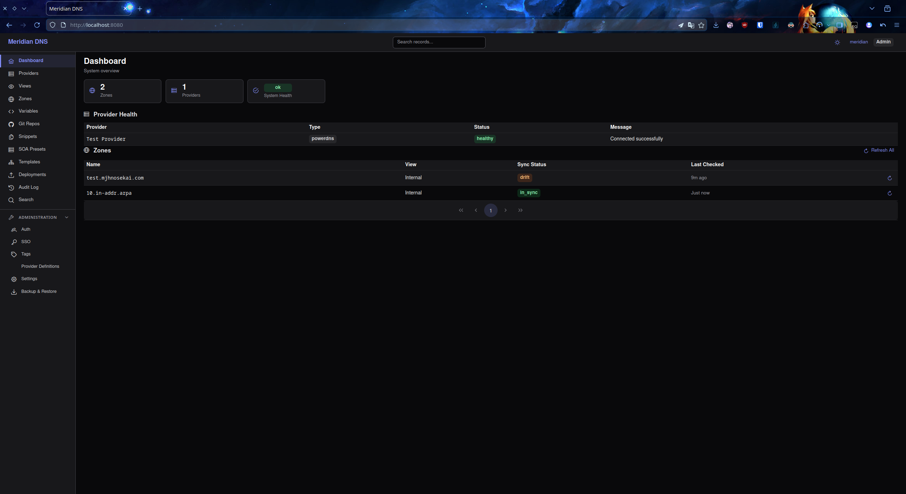

### Zone Records & Variable Templates

Manage DNS records with `{{variable}}` placeholders — update a variable once
and propagate to all referencing records. The autocomplete dropdown shows
available variables with their current values.

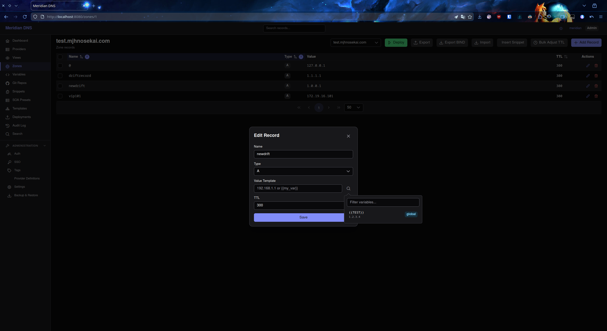

### Deployment Preview

Diff staged changes against live provider state before pushing. Colored
indicators show additions, modifications, and deletions.

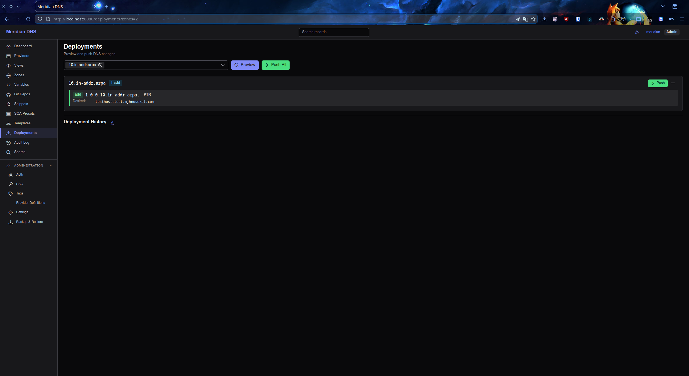

### Batch Import

Import records from CSV, JSON, DNSControl, or directly from a provider with
an editable preview before committing.

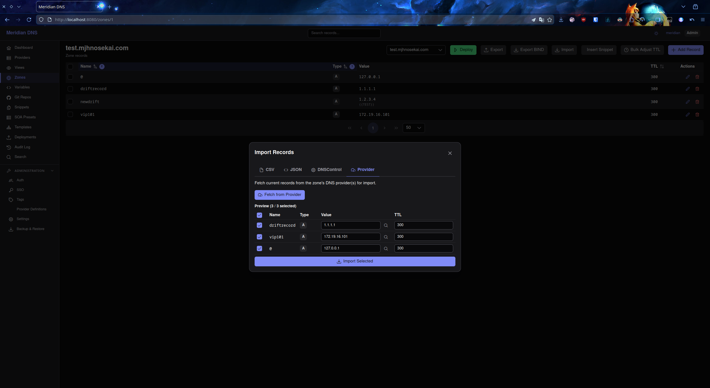

### Audit Trail

Every mutation logged with before/after state, filterable by entity type,
user, and date range.

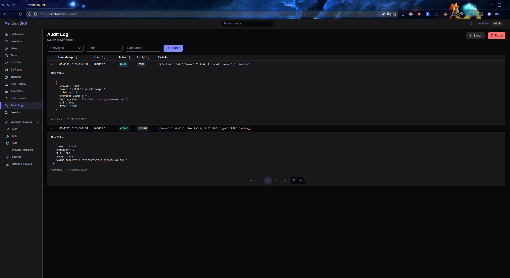

### User Profile & Theming

23 theme presets (14 dark, 9 light) with independent accent color
customization, font controls, and API key management.

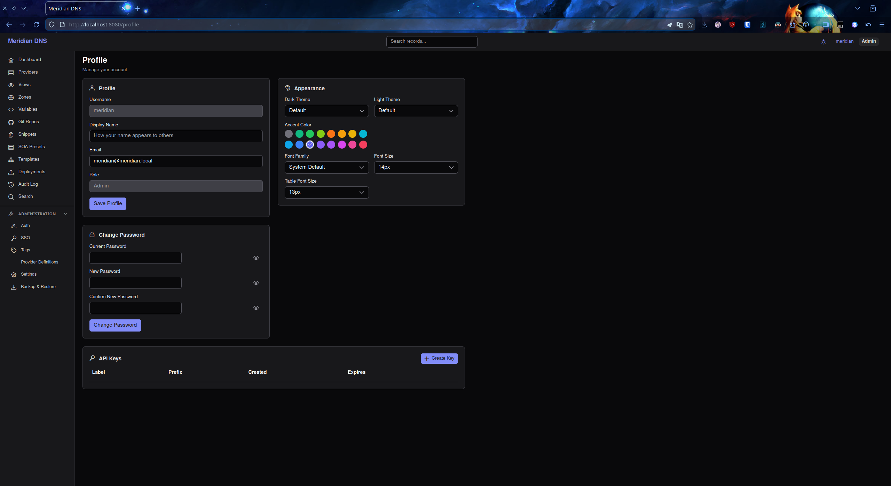

<details>
<summary>More screenshots</summary>

| Area | Screenshot |
|------|-----------|
| Setup wizard | 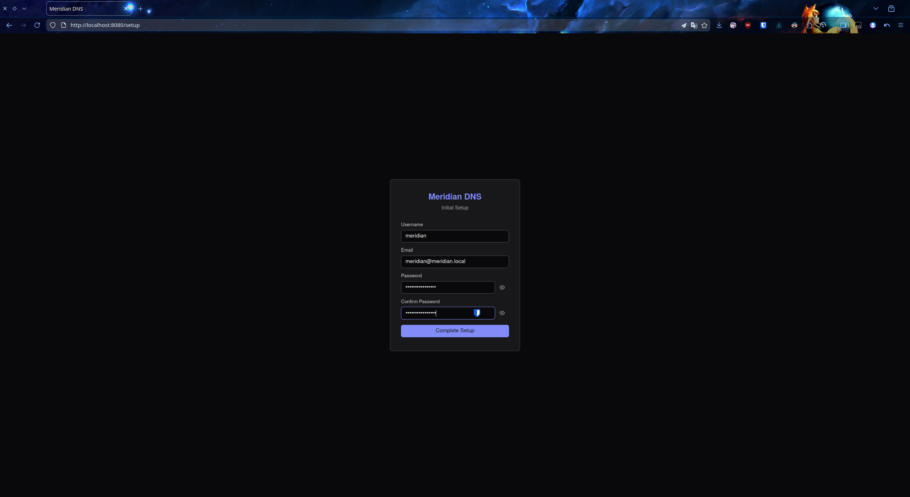 |
| Providers list | 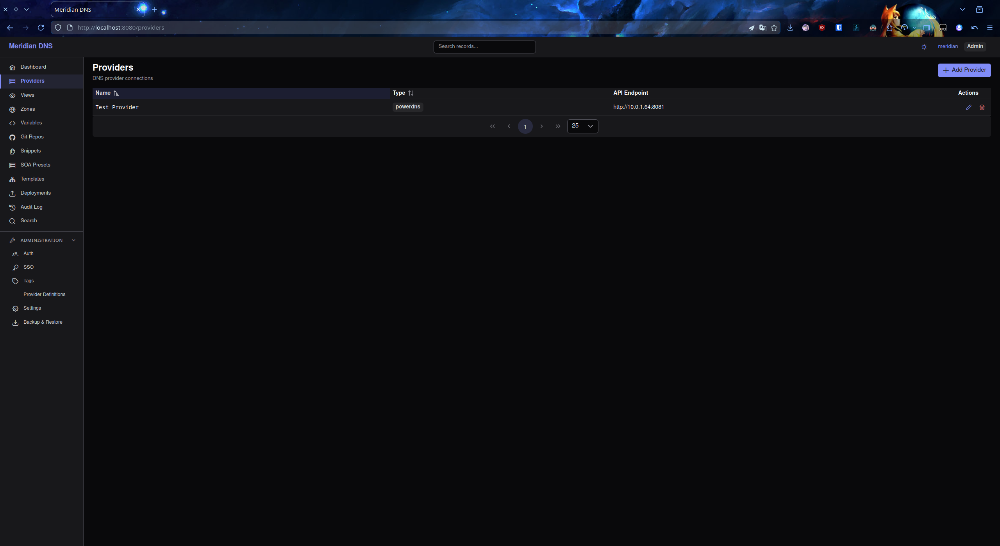 |
| Zones with tags | 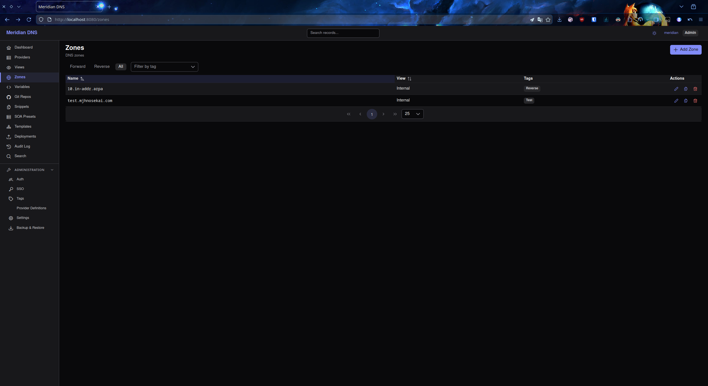 |
| Records list | 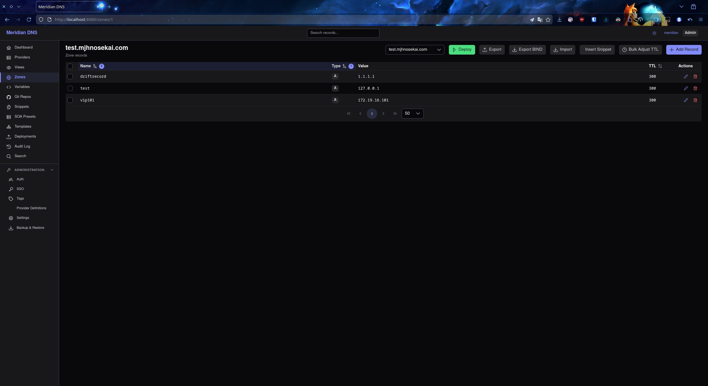 |
| Variables list | 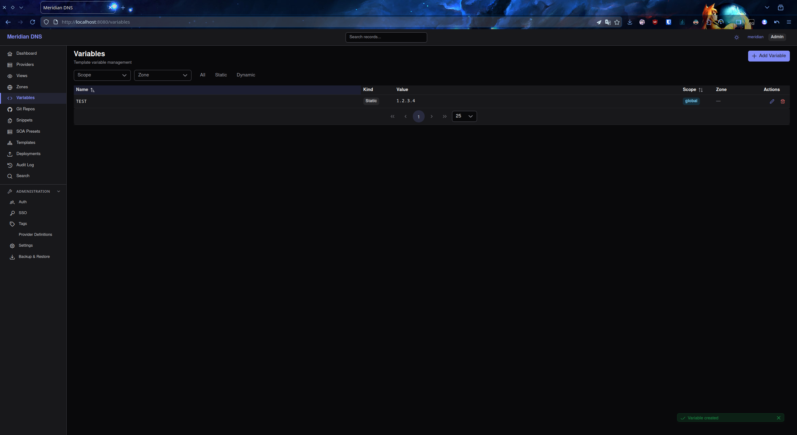 |
| Git repository setup | 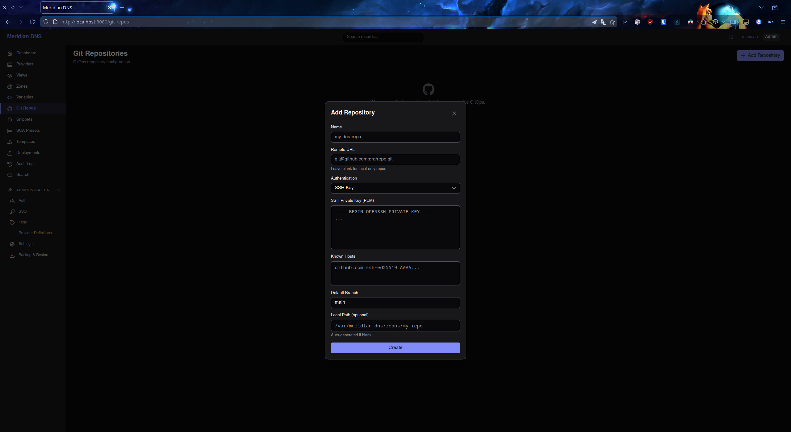 |
| RBAC roles | 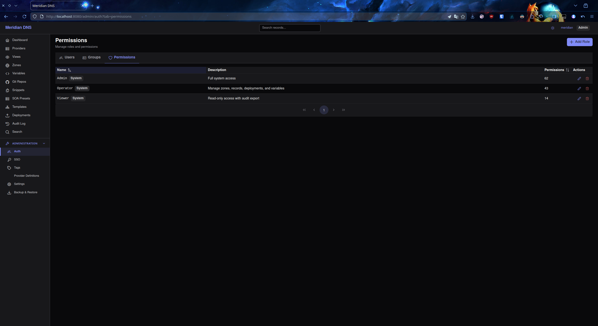 |
| System settings | 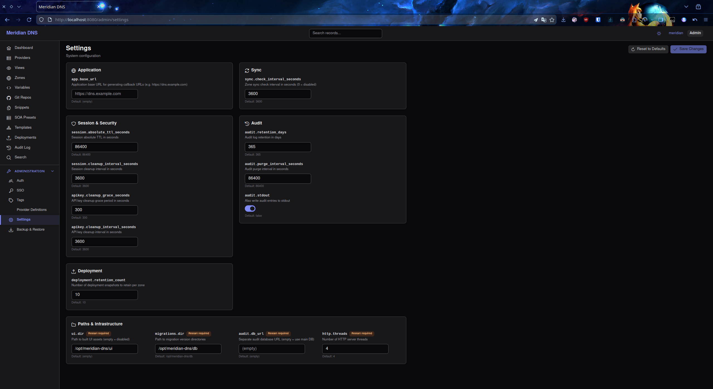 |
| Backup & restore | 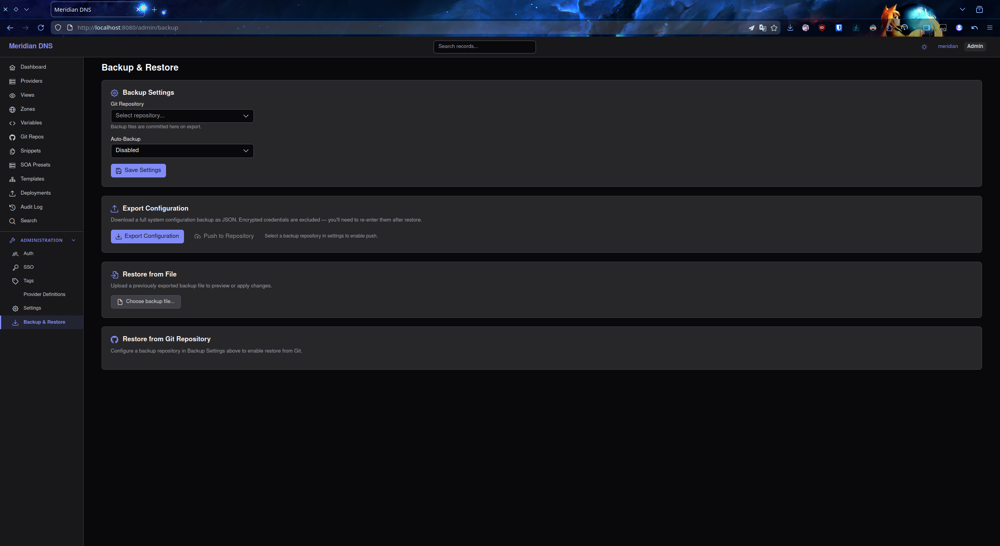 |

</details>

## Features

### Core

- **Multi-provider orchestration** — Manage PowerDNS, Cloudflare, and DigitalOcean
  through a unified API and UI with an extensible provider interface
- **Split-horizon views** — Define internal and external views for the same domain
  with strict record isolation
- **Variable templates** — Store records with `{{variable}}` placeholders; update a
  variable once and propagate to all referencing records
- **Preview-before-deploy** — Diff staged changes against live provider state,
  detect drift, and review before pushing
- **Deployment snapshots and rollback** — Every push captures a full zone snapshot;
  roll back to any previous state (full zone or cherry-picked records)
- **Batch record import** — CSV, JSON, DNSControl, and provider import with preview

### Operations

- **Multi-repo GitOps** — Zone snapshots committed to configured Git repositories
  with SSH/HTTPS auth and per-zone branch support
- **Zone capture** — Import existing DNS records from providers without deploying
  through the pipeline
- **Config backup and restore** — Full system export/import with preview mode
- **Audit trail** — Every mutation logged with before/after state, NDJSON export,
  configurable retention
- **Health probes** — Liveness and readiness endpoints for container orchestrators

### Security

- **Granular RBAC** — 63 discrete permissions in customizable roles (global
  scope in v1.0; view-level and zone-level scoping planned)
- **OIDC and SAML 2.0** — Federated login with auto-provisioning and IdP group mapping
- **API key authentication** — Programmatic access with one-time key display
- **AES-256-GCM encryption** — Provider tokens, Git credentials, and IdP secrets
  encrypted at rest
- **Argon2id password hashing** — Memory-hard password storage
- **HMAC-SHA256 JWT sessions** — Sliding and absolute TTL with server-side tracking

### UI

- **Vue 3 + PrimeVue** — Responsive web interface with deployment diff viewer
  and variable autocomplete
- **23 theme presets** — 14 dark themes (Catppuccin Mocha, Dracula, Nord, Tokyo Night,
  etc.) and 9 light themes with independent accent color customization
- **Database-backed settings** — Runtime configuration via Settings UI

## Quick Start

### Docker Compose (recommended)

```bash
# 1. Create environment file
cp .env.example .env

# Generate required secrets
sed -i "s/^DNS_MASTER_KEY=.*/DNS_MASTER_KEY=$(openssl rand -hex 32)/" .env
sed -i "s/^DNS_JWT_SECRET=.*/DNS_JWT_SECRET=$(openssl rand -hex 32)/" .env

# 2. Start the stack
docker compose up -d

# 3. Open browser
open http://localhost:8080
```

The setup wizard guides you through creating an admin account and configuring your
first DNS provider.

### From Source

See [BUILD_ENVIRONMENT.md](docs/BUILD_ENVIRONMENT.md) for full build instructions.
Docker is the recommended build method — native builds require Fedora 43 or
Arch Linux with matching dependencies.

## Documentation

| Document | Description |
|----------|-------------|
| [Deployment Guide](docs/DEPLOYMENT.md) | Docker Compose, reverse proxy, upgrading, health checks |
| [Configuration Reference](docs/CONFIGURATION.md) | Environment variables and DB-configurable settings |
| [Authentication Guide](docs/AUTHENTICATION.md) | Local, OIDC, SAML, and API key authentication |
| [GitOps Guide](docs/GITOPS.md) | Multi-repo setup, branch strategies, zone snapshots |
| [Permissions Guide](docs/PERMISSIONS.md) | RBAC model, roles, scoping, resolution logic |
| [Architecture](docs/ARCHITECTURE.md) | System design, components, data flows |
| [Build Environment](docs/BUILD_ENVIRONMENT.md) | Docker and native build setup |
| [Code Standards](docs/CODE_STANDARDS.md) | C++20 conventions, naming, formatting |
| [OpenAPI Spec](docs/openapi.yaml) | Complete REST API specification |

## Tech Stack

| Component | Technology |
|-----------|-----------|
| Language | C++20 (`-Wall -Wextra -Wpedantic -Werror`) |
| Build | CMake 3.20+ / Ninja |
| HTTP | Crow v1.3.1 (FetchContent) |
| Database | PostgreSQL 16 via libpqxx |
| Crypto | OpenSSL (AES-256-GCM, HMAC-SHA256 JWT, Argon2id) |
| Git | libgit2 |
| SAML | lasso + xmlsec1 |
| OIDC | liboauth2 + cjose (built from source) |
| Logging | spdlog |
| JSON | nlohmann/json |
| Testing | Google Test / Google Mock (FetchContent) |
| Frontend | Vue 3 + TypeScript + Vite |
| UI Components | PrimeVue (Aura preset) |
| State | Pinia |
| Routing | Vue Router 4 |
| Container | Multi-stage Docker (Fedora 43, ~180 MB runtime) |

## Contributing

See [CONTRIBUTING.md](CONTRIBUTING.md) for the contribution process, code standards,
and pull request guidelines.

## License

Meridian DNS is licensed under the
[GNU Affero General Public License v3.0](LICENSE) (AGPL-3.0-or-later).
