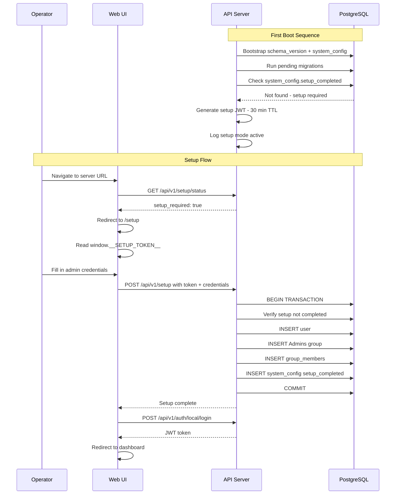

# Database Migrations & Initial Setup Wizard

> **Date:** 2026-03-06
> **Status:** Draft
> **Scope:** `--migrate` flag, auto-migration on startup, first-run setup wizard with one-time JWT token

---

## 1. Problem Statement

Two gaps exist in the current deployment story:

1. **No migration mechanism** — The binary has no `--migrate` flag. The Docker entrypoint calls `meridian-dns --migrate`, which fails with "Unknown option." Schema changes between releases cannot be applied incrementally; the only path is manual SQL execution or full DB recreation.

2. **No initial setup flow** — After a fresh deployment, no users exist in the database. The login page is useless because there's no way to create the first admin account without direct database access.

---

## 2. Database Migration System

### 2.1 Directory Structure

Migration files are organized into version directories under `scripts/db/`:

```
scripts/db/
  v001/
    001_initial_schema.sql
    002_add_indexes.sql
  v002/
    001_add_some_column.sql
```

- **`vNNN/`** — 3-digit zero-padded schema version directory
- **`NNN_description.sql`** — Execution sequence within a version (existing convention)
- Current files (`001_initial_schema.sql`, `002_add_indexes.sql`) move into `v001/`

### 2.2 Schema Version Tracking

A `schema_version` table tracks the current database schema version:

```sql
CREATE TABLE IF NOT EXISTS schema_version (
  version INTEGER NOT NULL
);
INSERT INTO schema_version (version) VALUES (0);
```

This table is created as a **bootstrap step** by the `MigrationRunner` before any version directories are processed. If the table already exists, bootstrap is skipped.

### 2.3 MigrationRunner Class

**Namespace:** `dns::dal`
**Files:** `include/dal/MigrationRunner.hpp`, `src/dal/MigrationRunner.cpp`

```
class MigrationRunner {
public:
  MigrationRunner(const std::string& sDbUrl, const std::string& sMigrationsDir);

  /// Run all pending migrations. Returns the new schema version.
  /// Throws on failure (transaction is rolled back for the failing version).
  int migrate();

  /// Get the current schema version from the database.
  int currentVersion();
};
```

**Execution flow:**

1. Open a single dedicated `pqxx::connection` (not from the pool — pool isn't initialized yet)
2. Bootstrap: `CREATE TABLE IF NOT EXISTS schema_version` with initial version 0
3. `SELECT version FROM schema_version` → `iLiveVersion`
4. Scan migrations directory for `vNNN/` subdirectories, sort numerically
5. For each directory where `iDirVersion > iLiveVersion`:
   a. Collect all `.sql` files in the directory, sort by sequence number
   b. Begin transaction
   c. Execute each SQL file in sequence order
   d. `UPDATE schema_version SET version = <iDirVersion>`
   e. Commit transaction
6. If any file fails: transaction rolls back for that version, process exits with error message identifying the failing file and version
7. Return the final schema version

### 2.4 CLI Integration

**`--migrate` flag:**
- Runs `MigrationRunner::migrate()` then exits
- Exit code 0 on success, 1 on failure
- Prints: `"Migrations complete. Schema version: N"` or error details

**Normal startup (auto-migrate):**
- Migrations run as **Step 0** in `main()`, before `ConnectionPool` initialization (Step 4)
- Uses the raw `DNS_DB_URL` connection string
- On failure, startup aborts with a clear error

### 2.5 Configuration

| Variable | Default | Description |
|----------|---------|-------------|
| `DNS_MIGRATIONS_DIR` | `/opt/meridian-dns/db` | Path to migration version directories |

### 2.6 Dockerfile Changes

The existing `COPY scripts/db/ /opt/meridian-dns/db/` line already copies migration files into the image. The entrypoint simplifies:

```sh
#!/bin/sh
set -e
exec "$@"
```

Since auto-migration happens on startup, the explicit `--migrate` call in the entrypoint is no longer needed. The `--migrate` flag remains available for standalone use (CI/CD, manual operations).

### 2.7 Docker Compose Changes

The `docker-compose.yml` currently mounts `./scripts/db` into Postgres's `docker-entrypoint-initdb.d`, which auto-runs SQL on first DB creation. This mount should be **removed** since the application now handles its own migrations. The `db` service volume becomes:

```yaml
volumes:
  - pgdata:/var/lib/postgresql/data
  # Removed: ./scripts/db:/docker-entrypoint-initdb.d:ro
```

---

## 3. Initial Setup Wizard

### 3.1 Overview

On first boot with an empty database, the server enters **setup mode**. A short-lived JWT token is generated and injected into the served web UI. The operator uses the setup page to create the first admin account. Once complete, setup mode is permanently disabled.

### 3.2 System Config Table

A `system_config` table provides persistent key-value storage for system state:

```sql
CREATE TABLE IF NOT EXISTS system_config (
  key   TEXT PRIMARY KEY,
  value TEXT NOT NULL
);
```

This table is created during the migration bootstrap step alongside `schema_version`.

**Keys used by setup:**
- `setup_completed` — `"true"` once initial setup finishes

### 3.3 Setup Mode Detection

On startup, after migrations complete:

1. Query `system_config` for `setup_completed`
2. If not present or not `"true"` → **setup mode active**
3. Generate a setup JWT (see §3.4)
4. Log: `"Setup mode active. Complete setup via the web UI within 30 minutes."`

### 3.4 One-Time Setup JWT

**Generation:**
- Signed with the same `IJwtSigner` used for auth (HS256)
- Payload: `{ "purpose": "setup", "iat": <now>, "exp": <now + 1800> }` (30-minute TTL)
- Stored in memory only — not persisted to database
- Regenerated on every restart while setup is incomplete

**Delivery to UI:**
- The `StaticFileHandler` detects setup mode
- When serving `index.html`, it injects a `<script>` tag before the closing `</head>`:
  ```html
  <script>window.__SETUP_TOKEN__ = "eyJ...";</script>
  ```
- The Vue app reads `window.__SETUP_TOKEN__` to determine setup mode and to authenticate the setup request
- When setup mode is not active, no injection occurs

**Validation:**
- `POST /api/v1/setup` extracts the token from the request body
- Verifies JWT signature and expiry using `IJwtSigner::verify()`
- Checks that `payload.purpose === "setup"`
- If expired: returns `401` with message to restart the server

### 3.5 Setup API Endpoints

#### `GET /api/v1/setup/status`

No authentication required.

**Response:**
```json
{ "setup_required": true }
```
or
```json
{ "setup_required": false }
```

Does NOT include the setup token — the token is only available via the injected HTML.

#### `POST /api/v1/setup`

No standard authentication required. Requires setup JWT in body.

**Request:**
```json
{
  "setup_token": "eyJ...",
  "username": "admin",
  "email": "admin@example.com",
  "password": "SecureP@ss123"
}
```

**Action (single transaction):**
1. Verify setup JWT (signature, expiry, purpose)
2. Check `system_config` for `setup_completed` — abort with 403 if already done
3. Verify no users exist (defense in depth)
4. Hash password with Argon2id
5. Insert user into `users` table (auth_method = 'local')
6. Insert "Admins" group with `role = 'admin'`
7. Add user to "Admins" group via `group_members`
8. Insert `setup_completed = true` into `system_config`
9. Commit transaction

**Response (success):**
```json
{
  "message": "Setup complete",
  "user_id": 1
}
```

**Error responses:**
- `403` — Setup already completed
- `401` — Invalid or expired setup token (message: restart server to get a new token)
- `422` — Validation errors (username/email/password requirements)

### 3.6 Protection Layers

| Layer | Mechanism | Purpose |
|-------|-----------|---------|
| 1 | In-memory `std::atomic<bool>` | Fast rejection without DB hit |
| 2 | `system_config.setup_completed` | Survives restarts |
| 3 | Transaction-level check | Prevents concurrent race conditions |
| 4 | Setup JWT with 30-min expiry | Time-bounded access window |

### 3.7 SetupRoutes Class

**Namespace:** `dns::api::routes`
**Files:** `include/api/routes/SetupRoutes.hpp`, `src/api/routes/SetupRoutes.cpp`

Dependencies:
- `dal::UserRepository` — user creation, existence check
- `dal::ConnectionPool` — for transactional setup execution
- `security::IJwtSigner` — setup token validation
- `security::CryptoService` — password hashing

### 3.8 Frontend: SetupView.vue

**Route:** `/setup`

**Fields:**
- Username (required, validated)
- Email (required, validated)
- Password (required, strength indicator)
- Confirm Password (must match)

**Flow:**
1. On app load, router guard calls `GET /api/v1/setup/status`
2. If `setup_required: true` → redirect to `/setup`
3. If `setup_required: false` and not authenticated → redirect to `/login`
4. Setup page reads `window.__SETUP_TOKEN__`
5. On form submit: `POST /api/v1/setup` with token + credentials
6. On success: call `POST /api/v1/auth/local/login` with the same credentials to get a JWT
7. Redirect to dashboard

**Expired token handling:**
- If setup returns 401 (expired token), show message: "Setup token expired. Please restart the server to generate a new token."

---

## 4. Data Flow



---

## 5. Files Changed / Created

### New Files

| File | Description |
|------|-------------|
| `include/dal/MigrationRunner.hpp` | Migration runner class declaration |
| `src/dal/MigrationRunner.cpp` | Migration runner implementation |
| `include/api/routes/SetupRoutes.hpp` | Setup route handler declaration |
| `src/api/routes/SetupRoutes.cpp` | Setup route handler implementation |
| `ui/src/views/SetupView.vue` | Setup wizard frontend page |
| `ui/src/api/setup.ts` | Setup API client functions |
| `scripts/db/v001/001_initial_schema.sql` | Moved from `scripts/db/` |
| `scripts/db/v001/002_add_indexes.sql` | Moved from `scripts/db/` |

### Modified Files

| File | Changes |
|------|---------|
| `src/main.cpp` | Add `--migrate` flag handling, Step 0 auto-migration, setup mode detection, setup JWT generation, pass setup state to StaticFileHandler and SetupRoutes |
| `include/common/Config.hpp` | Add `sMigrationsDir` field |
| `src/common/Config.cpp` | Load `DNS_MIGRATIONS_DIR` env var |
| `src/api/StaticFileHandler.cpp` | Inject setup JWT into `index.html` when in setup mode |
| `include/api/StaticFileHandler.hpp` | Add setup token setter/state |
| `src/api/ApiServer.cpp` | Register SetupRoutes |
| `include/api/ApiServer.hpp` | Accept SetupRoutes dependency |
| `ui/src/router/index.ts` | Add `/setup` route, add setup-check navigation guard |
| `ui/src/App.vue` | Handle setup redirect logic |
| `scripts/docker/entrypoint.sh` | Simplify to just `exec "$@"` |
| `docker-compose.yml` | Remove `scripts/db` mount from `db` service |
| `Dockerfile` | No changes needed — existing `COPY scripts/db/` handles new structure |
| `scripts/db/001_initial_schema.sql` | Removed — moved to `v001/` |
| `scripts/db/002_add_indexes.sql` | Removed — moved to `v001/` |

### Test Files

| File | Description |
|------|-------------|
| `tests/unit/test_migration_runner.cpp` | Unit tests for MigrationRunner |
| `tests/integration/test_setup_routes.cpp` | Integration tests for setup endpoint |

---

## 6. Implementation Tasks

### Phase A: Migration System

1. **Restructure migration directory** — Move existing SQL files into `scripts/db/v001/`
2. **Create MigrationRunner** — `include/dal/MigrationRunner.hpp` + `src/dal/MigrationRunner.cpp` with bootstrap, version scanning, and sequential execution
3. **Add `--migrate` flag to main.cpp** — Parse flag, run migrations, exit
4. **Add auto-migration to startup** — Step 0 in `main()` before ConnectionPool init
5. **Add `DNS_MIGRATIONS_DIR` to Config** — Default `/opt/meridian-dns/db`
6. **Update entrypoint.sh** — Remove explicit `--migrate` call
7. **Update docker-compose.yml** — Remove `scripts/db` mount from `db` service
8. **Write MigrationRunner tests** — Unit tests with mock filesystem, integration tests with real DB

### Phase B: Setup Wizard

9. **Add `system_config` table** — Created during migration bootstrap alongside `schema_version`
10. **Create SetupRoutes** — `include/api/routes/SetupRoutes.hpp` + `src/api/routes/SetupRoutes.cpp` with status and setup endpoints
11. **Add setup mode detection to main.cpp** — Check `system_config` after migrations, generate setup JWT, pass state to routes and static handler
12. **Modify StaticFileHandler** — Inject setup JWT into `index.html` when in setup mode
13. **Register SetupRoutes in ApiServer** — Add to constructor and route registration
14. **Create SetupView.vue** — Frontend setup wizard page with form validation
15. **Create setup API client** — `ui/src/api/setup.ts`
16. **Update router** — Add `/setup` route and navigation guard for setup detection
17. **Write setup tests** — Integration tests for the setup endpoint including token validation, one-time execution, and race condition protection
