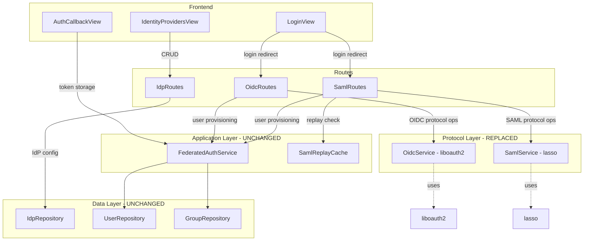
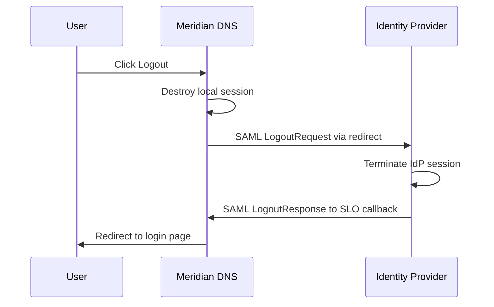
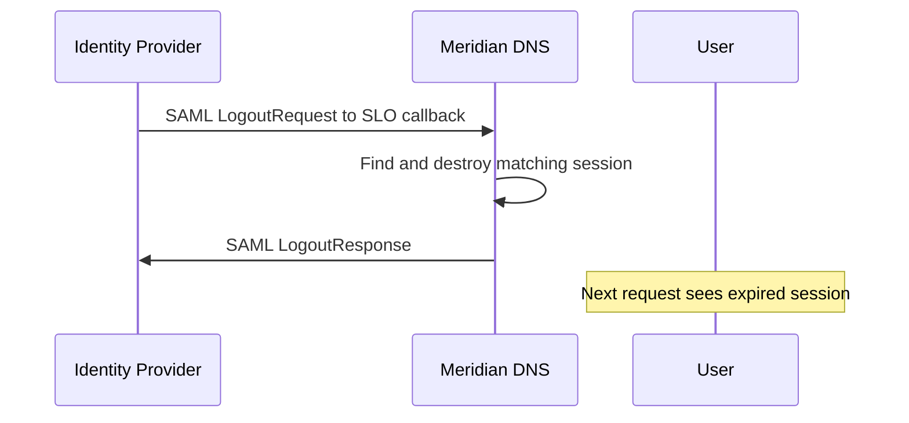
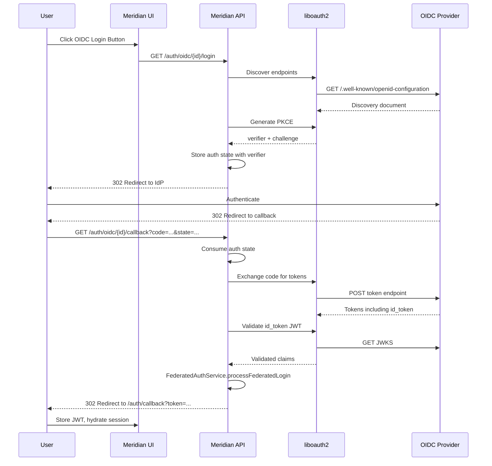
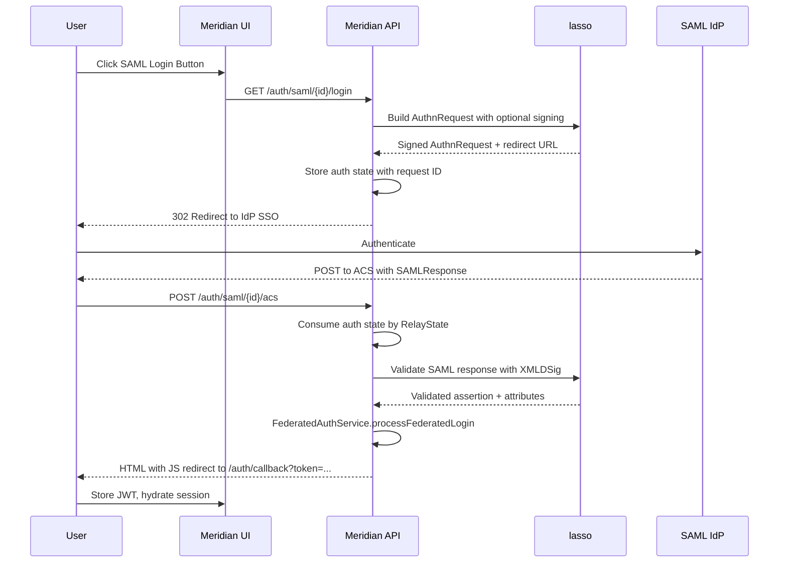
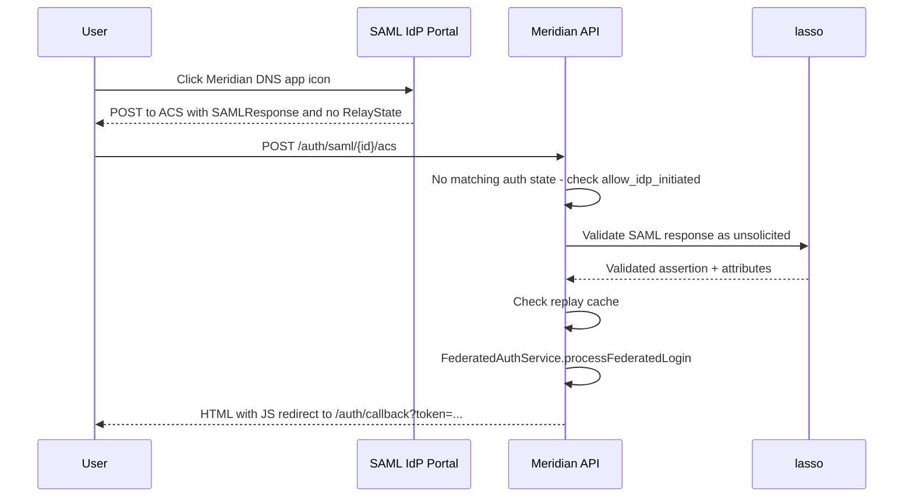

# OIDC & SAML Auth Refactor: liboauth2 + lasso

**Date:** 2026-03-14
**Status:** Draft
**Goal:** Replace hand-rolled OIDC and SAML protocol implementations with production-grade libraries (`liboauth2` for OIDC, `lasso` for SAML), adding IdP-initiated SAML login and optional SLO. Also remediate known container image vulnerabilities.

---

## Table of Contents

1. [Motivation](#motivation)
2. [Architecture Overview](#architecture-overview)
3. [Library Choices](#library-choices)
4. [Task 1: Build System — Add liboauth2 and lasso Dependencies](#task-1-build-system--add-liboauth2-and-lasso-dependencies)
5. [Task 2: Container Image Hardening](#task-2-container-image-hardening)
6. [Task 3: OidcService — Rewrite with liboauth2](#task-3-oidcservice--rewrite-with-liboauth2)
7. [Task 4: SamlService — Rewrite with lasso](#task-4-samlservice--rewrite-with-lasso)
8. [Task 5: IdP-Initiated SAML Login](#task-5-idp-initiated-saml-login)
9. [Task 6: SAML Metadata Endpoint](#task-6-saml-metadata-endpoint)
10. [Task 7: SAML Single Logout — Optional](#task-7-saml-single-logout--optional)
11. [Task 8: Database Schema Updates](#task-8-database-schema-updates)
12. [Task 9: Route Handler Updates](#task-9-route-handler-updates)
13. [Task 10: Frontend Updates](#task-10-frontend-updates)
14. [Task 11: Tests](#task-11-tests)
15. [Task 12: Dockerfile and CI Updates](#task-12-dockerfile-and-ci-updates)
16. [Task 13: Cleanup — Remove Custom Protocol Code](#task-13-cleanup--remove-custom-protocol-code)
17. [Files Changed Summary](#files-changed-summary)
18. [Flow Diagrams](#flow-diagrams)

---

## Motivation

The current OIDC and SAML implementations are hand-rolled (~1,135 lines of custom protocol code) with several production-critical deficiencies:

| Issue | Severity | Current Location |
|-------|----------|-----------------|
| SAML signature verification effectively disabled (no C14N) | **Critical** | `SamlService.cpp:463-566` |
| String-based XML parsing (find/substr) | **High** | `SamlService.cpp:238-375` |
| Custom JWT/JWKS crypto (manual RSA/EC key construction, DER encoding) | **High** | `OidcService.cpp:305-470` |
| No AuthnRequest signing | Medium | `SamlService.cpp:162-183` |
| No SAML metadata endpoint | Medium | Not implemented |
| No IdP-initiated SAML flow | Medium | Not implemented |
| No Single Logout support | Low | Not implemented |

Replacing with `liboauth2` and `lasso` addresses all of these while reducing maintenance surface.

---

## Architecture Overview

### What Changes

```
REPLACED (protocol layer):
  include/security/OidcService.hpp    → rewritten, wraps liboauth2
  src/security/OidcService.cpp        → rewritten, wraps liboauth2
  include/security/SamlService.hpp    → rewritten, wraps lasso
  src/security/SamlService.cpp        → rewritten, wraps lasso

MODIFIED (route handlers adapt to new service interfaces):
  src/api/routes/OidcRoutes.cpp       → minor changes to match new OidcService API
  src/api/routes/SamlRoutes.cpp       → updated for lasso-based validation + IdP-initiated
  src/api/routes/IdpRoutes.cpp        → add metadata endpoint, SLO config fields

ADDED:
  scripts/db/v013/001_saml_config_extensions.sql  → new SAML config fields

UNCHANGED:
  include/security/FederatedAuthService.hpp   — application logic, not protocol
  src/security/FederatedAuthService.cpp       — untouched
  include/dal/IdpRepository.hpp               — database CRUD, unrelated to protocol
  src/dal/IdpRepository.cpp                   — untouched
  include/security/SamlReplayCache.hpp        — still used for replay prevention
  src/security/SamlReplayCache.cpp            — untouched
  ui/src/views/AuthCallbackView.vue           — untouched
  ui/src/views/LoginView.vue                  — untouched (minor additions for IdP-initiated)
```

### Component Interaction



---

## Library Choices

### liboauth2

- **Source:** https://github.com/OpenIDC/liboauth2
- **Purpose:** OAuth 2.0 / OpenID Connect protocol operations
- **What it provides:** OIDC discovery, PKCE, token exchange, JWT/JWS validation, JWKS fetching and caching, base64url encoding
- **Dependencies:** cjose, jansson, libcurl, OpenSSL
- **Fedora packages:** Not in base repos — integrated via `ExternalProject_Add`
- **License:** Apache 2.0
- **Build system:** autotools (not CMake-native)

### lasso

- **Source:** https://lasso.entrouvert.org/
- **Purpose:** SAML 2.0 SP and IdP operations
- **What it provides:** AuthnRequest generation with signing, assertion validation with proper XMLDSig/C14N, IdP-initiated flow, metadata generation, SLO, HTTP-POST and HTTP-Redirect bindings
- **Dependencies:** libxml2, xmlsec1, glib-2.0
- **Fedora package:** `lasso-devel` (available in Fedora 43 repos)
- **License:** GPL-2.0+
- **Build system:** autotools — but depends on heavy system libraries (glib-2.0, libxml2, xmlsec1) that must come from the OS

### Build Strategy Decision

Both libraries use **autotools**, not CMake. CMake `FetchContent` works seamlessly only with CMake-native projects (like our existing Crow and cpp-httplib deps). For autotools projects we use `ExternalProject_Add`, which downloads, configures, and builds using the native `./configure && make` process.

| Library | Strategy | Rationale |
|---------|----------|-----------|
| **liboauth2** | `ExternalProject_Add` + cjose | Small library, not in Fedora repos, self-contained deps |
| **cjose** | `ExternalProject_Add` | Required by liboauth2, also not commonly packaged |
| **lasso** | System pkg-config | Deep deps on glib-2.0/libxml2/xmlsec1 — must come from OS |
| **jansson, libcurl** | System pkg-config | Standard system libraries, available everywhere |

---

## Task 1: Build System — Add liboauth2 and lasso Dependencies

**Files:**
- Modify: `CMakeLists.txt`
- Modify: `src/CMakeLists.txt`
- Modify: `Dockerfile`

### Step 1: Add system package dependencies via pkg-config

Add to `CMakeLists.txt` (alongside existing `pkg_check_modules`):

```cmake
# SAML via lasso (system package)
pkg_check_modules(LASSO REQUIRED lasso)

# liboauth2 transitive deps (system packages)
pkg_check_modules(JANSSON REQUIRED jansson)
pkg_check_modules(LIBCURL REQUIRED libcurl)
```

### Step 2: Add liboauth2 and cjose via ExternalProject_Add

Both liboauth2 and cjose use autotools. Add to `CMakeLists.txt`:

```cmake
include(ExternalProject)

# ── cjose (JOSE library, required by liboauth2) ─────────────────────────
ExternalProject_Add(cjose_ext
  GIT_REPOSITORY https://github.com/OpenIDC/cjose.git
  GIT_TAG        v0.6.2.3
  GIT_SHALLOW    TRUE
  CONFIGURE_COMMAND <SOURCE_DIR>/configure --prefix=<INSTALL_DIR>
                    --with-openssl=${OPENSSL_ROOT_DIR}
                    --with-jansson=yes
  BUILD_COMMAND     make -j${CMAKE_BUILD_PARALLEL_LEVEL}
  INSTALL_COMMAND   make install
  BUILD_IN_SOURCE   TRUE
  STEP_TARGETS      build
)
ExternalProject_Get_Property(cjose_ext INSTALL_DIR)
set(CJOSE_PREFIX ${INSTALL_DIR})

# ── liboauth2 (OIDC/OAuth2 library) ─────────────────────────────────────
ExternalProject_Add(liboauth2_ext
  GIT_REPOSITORY https://github.com/OpenIDC/liboauth2.git
  GIT_TAG        v2.1.0
  GIT_SHALLOW    TRUE
  DEPENDS        cjose_ext
  CONFIGURE_COMMAND autoreconf -fi <SOURCE_DIR>
    COMMAND <SOURCE_DIR>/configure --prefix=<INSTALL_DIR>
            PKG_CONFIG_PATH=${CJOSE_PREFIX}/lib/pkgconfig
  BUILD_COMMAND     make -j${CMAKE_BUILD_PARALLEL_LEVEL}
  INSTALL_COMMAND   make install
  BUILD_IN_SOURCE   TRUE
)
ExternalProject_Get_Property(liboauth2_ext INSTALL_DIR)
set(LIBOAUTH2_PREFIX ${INSTALL_DIR})

# Create imported targets for the built libraries
add_library(cjose SHARED IMPORTED)
set_target_properties(cjose PROPERTIES
  IMPORTED_LOCATION ${CJOSE_PREFIX}/lib/libcjose.so
  INTERFACE_INCLUDE_DIRECTORIES ${CJOSE_PREFIX}/include
)
add_dependencies(cjose cjose_ext)

add_library(oauth2 SHARED IMPORTED)
set_target_properties(oauth2 PROPERTIES
  IMPORTED_LOCATION ${LIBOAUTH2_PREFIX}/lib/liboauth2.so
  INTERFACE_INCLUDE_DIRECTORIES ${LIBOAUTH2_PREFIX}/include
)
add_dependencies(oauth2 liboauth2_ext)
```

### Step 3: Link in src/CMakeLists.txt

```cmake
target_link_libraries(meridian-core PUBLIC
  PkgConfig::LIBPQXX
  OpenSSL::SSL
  OpenSSL::Crypto
  nlohmann_json::nlohmann_json
  spdlog::spdlog
  PkgConfig::LIBGIT2
  Crow::Crow
  httplib::httplib
  PkgConfig::LASSO
  PkgConfig::JANSSON
  PkgConfig::LIBCURL
  oauth2
  cjose
)
```

### Step 4: Update Dockerfile builder stage

Add system dev packages needed by lasso and the ExternalProject builds:

```dockerfile
RUN dnf install -y --setopt=install_weak_deps=False \
  cmake ninja-build gcc-c++ \
  libpqxx-devel openssl-devel libgit2-devel \
  json-devel spdlog-devel \
  asio-devel \
  pkgconf-pkg-config \
  git ca-certificates \
  # New: lasso and its dependencies
  lasso-devel libxml2-devel xmlsec1-devel xmlsec1-openssl-devel glib2-devel \
  # New: liboauth2 transitive deps + autotools for ExternalProject builds
  jansson-devel libcurl-devel cjose-devel \
  autoconf automake libtool \
  && dnf clean all
```

### Step 5: Update Dockerfile runtime stage

```dockerfile
RUN dnf install -y --setopt=install_weak_deps=False \
  libpq libpqxx openssl-libs libgit2 spdlog fmt \
  git ca-certificates openssh-clients \
  # New: lasso runtime + liboauth2 transitive deps
  lasso libxml2 xmlsec1 xmlsec1-openssl glib2 \
  jansson libcurl cjose \
  && dnf clean all
```

### Step 6: Verify build

```bash
cmake -B build -G Ninja && cmake --build build --parallel
```

### Step 7: Commit

```
feat(auth): add liboauth2 via ExternalProject and lasso via pkg-config
```

---

## Task 2: Container Image Hardening

**Files:**
- Modify: `Dockerfile`

### Motivation

The Fedora 43 base image ships with 5 known medium-severity vulnerabilities in OS packages:

| Package | Vulnerability | Severity |
|---------|--------------|----------|
| `gnutls` | DOS via algorithmic complexity | Medium |
| `p11-kit-trust` | — | Medium |
| `p11-kit` | — | Medium |
| `libssh-config` | — | Medium |
| `libssh` | — | Medium |

### Step 1: Add security updates to both Docker stages

Add `dnf update -y` early in both the builder and runtime stages to pull in all security patches from the Fedora repos:

```dockerfile
# ── Stage 2: C++ build ─────────────────────────────────────────────────
FROM fedora:43 AS builder

# Apply all security patches before installing dev packages
RUN dnf update -y --setopt=install_weak_deps=False && dnf clean all

RUN dnf install -y --setopt=install_weak_deps=False \
  ...existing packages...
```

```dockerfile
# ── Stage 3: Runtime ───────────────────────────────────────────────────
FROM fedora:43 AS runtime

# Apply all security patches
RUN dnf update -y --setopt=install_weak_deps=False && dnf clean all

RUN dnf install -y --setopt=install_weak_deps=False \
  ...existing packages...
```

### Step 2: Minimize unnecessary packages in runtime

Review runtime packages — some of the vulnerable packages might be indirect dependencies we can avoid:

- `gnutls` — pulled by `libssh` which is pulled by `openssh-clients`. Since we need `openssh-clients` for GitOps SSH operations, we can't remove it, but the update should patch the vulnerability.
- `p11-kit` / `p11-kit-trust` — certificate trust store management, needed for TLS certificate validation. Cannot remove.
- `libssh` / `libssh-config` — transitive dependency of `openssh-clients`. Cannot remove.

All 5 packages are required; the fix is ensuring they are updated to patched versions.

### Step 3: Add a healthcheck and non-root verification

While hardening, also ensure:
- The `USER meridian-dns` directive is present (already is)
- No unnecessary capabilities are granted
- Add a `HEALTHCHECK` instruction:

```dockerfile
HEALTHCHECK --interval=30s --timeout=5s --start-period=10s --retries=3 \
  CMD ["/usr/local/bin/meridian-dns", "--healthcheck"] || exit 1
```

Or if the app doesn't support `--healthcheck`, use curl against the health endpoint:

```dockerfile
HEALTHCHECK --interval=30s --timeout=5s --start-period=10s --retries=3 \
  CMD curl -f http://localhost:8080/api/v1/health || exit 1
```

Note: Adding curl to runtime requires including it in the runtime package list (it may already be present as a libcurl dependency).

### Step 4: Verify no remaining vulnerabilities

After building the updated image, scan with the same tool to confirm the 5 medium-severity issues are resolved.

### Step 5: Commit

```
security(docker): apply OS security patches and add healthcheck
```

---

## Task 3: OidcService — Rewrite with liboauth2

**Files:**
- Rewrite: `include/security/OidcService.hpp`
- Rewrite: `src/security/OidcService.cpp`

### Design

The new `OidcService` wraps liboauth2 for all OIDC protocol operations. The class retains its name and role but replaces all internal crypto/protocol code with library calls.

**New header:**

```cpp
#pragma once

#include <chrono>
#include <cstdint>
#include <mutex>
#include <optional>
#include <string>
#include <unordered_map>

#include <nlohmann/json.hpp>

// Forward declarations for liboauth2 types
struct oauth2_cfg_openidc_t;
struct oauth2_log_t;

namespace dns::security {

/// State stored during OIDC authorization flow.
struct OidcAuthState {
  std::string sCodeVerifier;
  int64_t iIdpId = 0;
  bool bIsTestMode = false;
  std::chrono::system_clock::time_point tpCreatedAt;
};

/// Cached OIDC discovery document.
struct OidcDiscovery {
  std::string sAuthorizationEndpoint;
  std::string sTokenEndpoint;
  std::string sJwksUri;
  std::string sIssuer;
  std::chrono::system_clock::time_point tpFetchedAt;
};

/// Handles OIDC protocol operations using liboauth2.
/// Class abbreviation: os
class OidcService {
 public:
  OidcService();
  ~OidcService();

  // Non-copyable (owns liboauth2 resources)
  OidcService(const OidcService&) = delete;
  OidcService& operator=(const OidcService&) = delete;

  /// Generate PKCE code_verifier and code_challenge (S256).
  static std::pair<std::string, std::string> generatePkce();

  /// Generate a random state string for CSRF prevention.
  static std::string generateState();

  /// Build the authorization URL with all required query parameters.
  static std::string buildAuthorizationUrl(
      const std::string& sAuthEndpoint, const std::string& sClientId,
      const std::string& sRedirectUri, const std::string& sScope,
      const std::string& sState, const std::string& sCodeChallenge);

  /// Store auth state keyed by state string.
  void storeAuthState(const std::string& sState, OidcAuthState oaState);

  /// Consume auth state. Returns nullopt if not found or expired.
  std::optional<OidcAuthState> consumeAuthState(const std::string& sState);

  /// Fetch and cache the OIDC discovery document.
  OidcDiscovery discover(const std::string& sIssuerUrl);

  /// Exchange authorization code for tokens.
  nlohmann::json exchangeCode(const std::string& sTokenEndpoint,
                              const std::string& sCode,
                              const std::string& sClientId,
                              const std::string& sClientSecret,
                              const std::string& sRedirectUri,
                              const std::string& sCodeVerifier);

  /// Validate an ID token JWT using liboauth2 JOSE.
  /// Fetches JWKS, verifies signature, validates claims.
  nlohmann::json validateIdToken(const std::string& sIdToken,
                                 const std::string& sJwksUri,
                                 const std::string& sExpectedIssuer,
                                 const std::string& sExpectedAudience);

 private:
  void evictExpiredStates();

  std::mutex _mtxStates;
  std::unordered_map<std::string, OidcAuthState> _mAuthStates;

  std::mutex _mtxDiscovery;
  std::unordered_map<std::string, OidcDiscovery> _mDiscoveryCache;
};

}  // namespace dns::security
```

### Key Implementation Changes

| Operation | Before (custom) | After (liboauth2) |
|-----------|-----------------|-------------------|
| PKCE generation | Manual RAND_bytes + base64url | `oauth2_pkce_generate()` or equivalent |
| Discovery fetch | Manual httplib GET + JSON parse | `oauth2_openidc_metadata_resolve()` |
| Token exchange | Manual httplib POST | `oauth2_http_call()` with token params |
| JWT validation | Manual JWT split, JWKS fetch, EVP_PKEY construction, signature verify | `oauth2_jose_jwt_verify()` with JWKS URI |
| Base64url | Hand-rolled EVP_Encode + char replace | liboauth2 internal / `oauth2_base64url_encode()` |

### What's Preserved

- **Auth state management** (`storeAuthState`/`consumeAuthState`) — simple in-memory map with TTL, no reason to change
- **Method signatures** — the public API stays the same so route handlers need minimal changes
- **Error types** — still throws `common::AuthenticationError` and `common::ValidationError`

### Implementation Notes

- liboauth2 uses `cjose` internally for JOSE operations. The `oauth2_jose_jwt_verify()` function handles:
  - JWKS fetching and caching
  - Key matching by `kid`
  - RS256, RS384, RS512, ES256, ES384, ES512, PS256, PS384, PS512 algorithms
  - Signature verification
  - Claims extraction
- For discovery, liboauth2 provides metadata resolution that handles caching internally
- The token exchange can use liboauth2's HTTP client (`oauth2_http_call`) or we can keep using cpp-httplib for consistency with the rest of the codebase — the critical fix is the JWT validation, not the HTTP transport

### Step 1: Write the new implementation

Replace `src/security/OidcService.cpp` with liboauth2-based implementation. Initialize liboauth2 logging to route through spdlog. Use `oauth2_jose_jwt_verify()` for ID token validation instead of manual crypto.

### Step 2: Verify unit tests pass

Existing tests for PKCE generation, state management, and claim validation should continue to pass with minimal changes. The `ValidateIdTokenRejectsExpiredToken`, `ValidateIdTokenRejectsWrongIssuer`, and `ValidateIdTokenRejectsWrongAudience` tests validate behavior that liboauth2 also enforces.

### Step 3: Commit

```
refactor(oidc): replace custom JWT/JWKS crypto with liboauth2
```

---

## Task 4: SamlService — Rewrite with lasso

**Files:**
- Rewrite: `include/security/SamlService.hpp`
- Rewrite: `src/security/SamlService.cpp`

### Design

The new `SamlService` wraps lasso for all SAML 2.0 protocol operations. This is the most impactful change — it replaces ~622 lines of fragile string-based XML manipulation with proper XMLDSig verification via lasso/xmlsec1.

**New header:**

```cpp
#pragma once

#include <chrono>
#include <cstdint>
#include <mutex>
#include <optional>
#include <string>
#include <unordered_map>

#include <nlohmann/json.hpp>

// Forward declarations for lasso types
struct LassoServer;

namespace dns::security {

class SamlReplayCache;

/// Configuration for a SAML service provider session with lasso.
struct SamlSpConfig {
  std::string sSpEntityId;
  std::string sAcsUrl;
  std::string sSloUrl;           // Empty if SLO disabled
  std::string sSpPrivateKeyPem;  // Empty if request signing disabled
  std::string sSpCertPem;        // SP certificate for metadata
};

/// Configuration for a SAML identity provider in lasso.
struct SamlIdpConfig {
  std::string sIdpEntityId;
  std::string sSsoUrl;
  std::string sSloUrl;           // Empty if SLO not supported
  std::string sIdpCertPem;
  bool bAllowIdpInitiated = false;
  bool bWantAssertionsSigned = true;
};

/// State stored during SAML authorization flow.
struct SamlAuthState {
  int64_t iIdpId = 0;
  std::string sRequestId;
  bool bIsTestMode = false;
  std::chrono::system_clock::time_point tpCreatedAt;
};

/// Result of a successful SAML assertion validation.
struct SamlAssertionResult {
  std::string sNameId;
  nlohmann::json jAttributes;
  std::string sSessionIndex;  // For SLO
};

/// Handles SAML 2.0 protocol operations using lasso.
/// Class abbreviation: ss
class SamlService {
 public:
  explicit SamlService(SamlReplayCache& srcCache);
  ~SamlService();

  // Non-copyable (owns lasso resources)
  SamlService(const SamlService&) = delete;
  SamlService& operator=(const SamlService&) = delete;

  /// Initialize lasso library (call once at startup).
  static void initLibrary();

  /// Create a LassoServer for an SP+IdP pair and cache it.
  /// Must be called before protocol operations for a given IdP.
  void registerIdp(int64_t iIdpId,
                   const SamlSpConfig& spConfig,
                   const SamlIdpConfig& idpConfig);

  /// Generate a SAML AuthnRequest and return the redirect URL.
  /// The request ID is stored internally for InResponseTo validation.
  std::string buildLoginUrl(int64_t iIdpId, const std::string& sRelayState);

  /// Validate an SP-initiated SAML response (has matching AuthnRequest).
  SamlAssertionResult validateSpInitiatedResponse(
      int64_t iIdpId,
      const std::string& sSamlResponse,
      const std::string& sExpectedRequestId);

  /// Validate an IdP-initiated SAML response (no prior AuthnRequest).
  SamlAssertionResult validateIdpInitiatedResponse(
      int64_t iIdpId,
      const std::string& sSamlResponse);

  /// Generate SP SAML metadata XML for a given IdP configuration.
  std::string generateMetadata(int64_t iIdpId);

  /// Initiate a SAML SLO request. Returns redirect URL or empty if unsupported.
  std::string initiateSlo(int64_t iIdpId, const std::string& sNameId,
                          const std::string& sSessionIndex);

  /// Process an incoming SLO request from the IdP.
  std::string processSloRequest(int64_t iIdpId, const std::string& sSloRequest);

  /// Auth state management (unchanged from current implementation).
  void storeAuthState(const std::string& sRelayState, SamlAuthState saState);
  std::optional<SamlAuthState> consumeAuthState(const std::string& sRelayState);

 private:
  void evictExpiredStates();

  /// Extract attributes from a validated lasso assertion into JSON.
  static nlohmann::json extractAttributes(void* pAssertion);

  SamlReplayCache& _srcCache;

  std::mutex _mtxStates;
  std::unordered_map<std::string, SamlAuthState> _mAuthStates;

  /// Cached LassoServer instances per IdP ID.
  std::mutex _mtxServers;
  std::unordered_map<int64_t, LassoServer*> _mServers;
};

}  // namespace dns::security
```

### Key Implementation Changes

| Operation | Before (custom) | After (lasso) |
|-----------|-----------------|--------------|
| AuthnRequest generation | Manual XML string concatenation | `lasso_login_init_authn_request()` |
| AuthnRequest signing | **Not implemented** | `lasso_profile_set_signature_method()` + lasso auto-signs |
| Redirect URL building | Manual deflate + base64 + URL encode | `lasso_login_build_authn_request_msg()` |
| Assertion validation | String-based find/substr XML parsing | `lasso_login_process_authn_response_msg()` |
| XMLDSig verification | **Broken** (no C14N, warning-only) | lasso + xmlsec1 (proper C14N + sig verify) |
| Attribute extraction | String-based `extractAttributeValues()` | lasso assertion API + libxml2 XPath |
| Audience validation | Manual string comparison | lasso validates automatically |
| Time validation | Manual `parseIso8601()` comparison | lasso validates automatically |
| IdP-initiated | **Not supported** | `lasso_login_process_authn_response_msg()` without prior request |
| Metadata generation | **Not implemented** | `lasso_server_dump()` or manual from LassoServer |
| SLO | **Not implemented** | `lasso_logout_init_request()` / `lasso_logout_process_request_msg()` |

### lasso Initialization Pattern

```cpp
// One-time library init (in main.cpp or SamlService::initLibrary)
lasso_init();

// Per-IdP: create LassoServer with SP metadata
LassoServer* server = lasso_server_new(sp_metadata_path, sp_private_key_path);
lasso_server_add_provider(server, LASSO_PROVIDER_ROLE_IDP,
                          idp_metadata_path, NULL, NULL);

// SP-initiated login
LassoLogin* login = lasso_login_new(server);
lasso_login_init_authn_request(login, idp_entity_id, LASSO_HTTP_METHOD_REDIRECT);
lasso_login_build_authn_request_msg(login);
// redirect URL is now in LASSO_PROFILE(login)->msg_url

// Assertion validation
LassoLogin* login = lasso_login_new(server);
lasso_login_process_authn_response_msg(login, saml_response_base64);
lasso_login_accept_sso(login);
// assertion is validated, attributes available via LASSO_PROFILE(login)->identity
```

### Metadata Handling

lasso requires SP and IdP metadata as files or in-memory XML strings. Since our IdP configuration is stored in the database JSONB, we'll need to:

1. **Generate SP metadata dynamically** from `SamlSpConfig` fields
2. **Generate IdP metadata dynamically** from `SamlIdpConfig` fields (or accept raw IdP metadata XML)
3. Pass these to `lasso_server_new_from_dump()` or write temp files

The recommended approach is to generate minimal metadata XML strings in memory and use `lasso_server_new_from_buffers()` (available in lasso >= 2.8) or write to `/tmp` with secure permissions.

### Step 1: Write the new implementation

Replace `src/security/SamlService.cpp` with lasso-based implementation. Key changes:
- Initialize `LassoServer` per IdP with SP and IdP metadata
- Use `lasso_login_*` for AuthnRequest generation and assertion validation
- Use `lasso_logout_*` for SLO operations
- Route lasso logging through spdlog

### Step 2: Verify unit tests pass

Update `tests/unit/test_saml_service.cpp` — the existing tests for AuthnRequest generation, redirect URL building, and state management should pass. Assertion validation tests will need updating since lasso handles signature verification differently (it requires proper certificates even in tests).

### Step 3: Commit

```
refactor(saml): replace custom XML parsing with lasso for proper XMLDSig
```

---

## Task 5: IdP-Initiated SAML Login

**Files:**
- Modify: `src/api/routes/SamlRoutes.cpp`
- Modify: `src/security/SamlService.cpp` (already part of Task 3)

### Design

IdP-initiated SAML login occurs when a user clicks the application in their IdP portal (e.g., Okta, Azure AD dashboard). The IdP sends a SAML response directly to the ACS URL without a prior AuthnRequest from the SP.

**Key differences from SP-initiated:**
- No `RelayState` or it contains a fixed value set by the IdP
- No `InResponseTo` in the assertion (no prior AuthnRequest to reference)
- Must still validate signature, audience, conditions, and replay

### Route Changes

The existing ACS endpoint `POST /api/v1/auth/saml/<int>/acs` needs to handle both flows:

```cpp
// If RelayState matches a stored auth state → SP-initiated flow
// If RelayState is empty or doesn't match → check if IdP allows IdP-initiated
if (oState.has_value()) {
  // SP-initiated: validate with InResponseTo check
  auto result = _ssService.validateSpInitiatedResponse(
      iIdpId, sSamlResponse, oState->sRequestId);
} else {
  // IdP-initiated: validate without InResponseTo, must be enabled for this IdP
  if (!oIdp->jConfig.value("allow_idp_initiated", false)) {
    throw AuthenticationError("IDP_INITIATED_DISABLED", ...);
  }
  auto result = _ssService.validateIdpInitiatedResponse(iIdpId, sSamlResponse);
}
```

### Security Considerations

IdP-initiated SAML is inherently less secure because:
- No request-response binding (no InResponseTo)
- Replay protection is the only defense against assertion reuse
- `SamlReplayCache` is critical — assertion IDs must be tracked

This is why the `allow_idp_initiated` config flag defaults to `false`.

### Step 1: Implement

Update `SamlRoutes.cpp` ACS handler to detect IdP-initiated flow and call `validateIdpInitiatedResponse()`.

### Step 2: Test

Add integration test for IdP-initiated flow with a test SAML response.

### Step 3: Commit

```
feat(saml): support IdP-initiated SAML login with configurable opt-in
```

---

## Task 6: SAML Metadata Endpoint

**Files:**
- Modify: `src/api/routes/SamlRoutes.cpp`

### Design

Add a public endpoint that returns the SP's SAML metadata XML for a given IdP configuration. This allows IdP administrators to import configuration automatically rather than manually entering every field.

**Endpoint:** `GET /api/v1/auth/saml/<int>/metadata`

**Response:** XML content type, SAML 2.0 SP metadata document containing:
- SP entity ID
- ACS URL (POST binding)
- SLO URL (if configured)
- SP signing certificate (if configured)
- NameID format preference

### Implementation

```cpp
CROW_ROUTE(app, "/api/v1/auth/saml/<int>/metadata").methods("GET"_method)(
    [this](const crow::request&, int iIdpId) -> crow::response {
      auto sMetadata = _ssService.generateMetadata(iIdpId);
      crow::response resp(200);
      resp.set_header("Content-Type", "application/samlmetadata+xml");
      resp.body = sMetadata;
      return resp;
    });
```

### Step 1: Implement metadata generation in SamlService

Use lasso's metadata facilities or manually generate the standard XML structure from the SP configuration.

### Step 2: Commit

```
feat(saml): add SP metadata endpoint for IdP configuration import
```

---

## Task 7: SAML Single Logout — Optional

**Files:**
- Modify: `src/api/routes/SamlRoutes.cpp`
- Modify: `include/security/SamlService.hpp` / `src/security/SamlService.cpp`
- Modify: `src/api/routes/AuthRoutes.cpp` (existing logout route)

### Design

SLO is configurable per IdP via the `slo_url` field in the SAML config. When present and non-empty, logout triggers a SAML LogoutRequest to the IdP.

**New endpoints:**
- `GET /api/v1/auth/saml/<int>/slo` — initiate SP-initiated SLO
- `GET|POST /api/v1/auth/saml/<int>/slo/callback` — handle IdP SLO response
- No changes if `slo_url` is empty — existing local logout behavior unchanged

### SP-Initiated SLO Flow



### IdP-Initiated SLO Flow

The IdP can also initiate logout (e.g., user logs out from IdP portal):



### Session Index Tracking

SLO requires the SAML `SessionIndex` from the login assertion to be stored alongside the user session. This allows the SLO handler to find the correct session to terminate.

**Database change:** Add `saml_session_index` column to the `sessions` table, or store it in the session metadata. See Task 7.

### Implementation

Using lasso:

```cpp
// Initiate SLO
LassoLogout* logout = lasso_logout_new(server);
lasso_logout_init_request(logout, name_id, LASSO_HTTP_METHOD_REDIRECT);
lasso_logout_build_request_msg(logout);
// redirect to LASSO_PROFILE(logout)->msg_url

// Handle SLO response
LassoLogout* logout = lasso_logout_new(server);
lasso_logout_process_response_msg(logout, response);
// validate and redirect to login
```

### Step 1: Implement SLO endpoints

### Step 2: Add SAML session index to session storage

### Step 3: Wire existing logout route to trigger SLO when applicable

### Step 4: Commit

```
feat(saml): add optional SAML Single Logout support
```

---

## Task 8: Database Schema Updates

**Files:**
- Create: `scripts/db/v013/001_saml_config_extensions.sql`

### New Config Fields

The `identity_providers.config` JSONB gains new optional fields for SAML:

| Field | Type | Default | Purpose |
|-------|------|---------|---------|
| `allow_idp_initiated` | boolean | `false` | Accept SAML responses without prior AuthnRequest |
| `sign_requests` | boolean | `false` | Sign SAML AuthnRequests with SP private key |
| `want_assertions_signed` | boolean | `true` | Require IdP to sign assertions |
| `slo_url` | string | `""` | IdP's SLO endpoint URL (empty = SLO disabled) |
| `sp_certificate` | text | `""` | SP public certificate PEM for metadata |
| `idp_metadata_url` | string | `""` | URL to fetch IdP metadata (alternative to manual config) |

The `encrypted_secret` column for SAML IdPs stores the **SP private key PEM** (for signing AuthnRequests), encrypted via `CryptoService`. For OIDC IdPs, it continues to store the client secret.

### Sessions Table Extension

For SLO support, add a column to track the SAML session index:

```sql
-- v013: SAML extensions for lasso integration
ALTER TABLE sessions ADD COLUMN saml_session_index TEXT;
CREATE INDEX idx_sessions_saml_session_index
  ON sessions (saml_session_index)
  WHERE saml_session_index IS NOT NULL;
```

### No Breaking Changes

All new fields are optional with sensible defaults. Existing SAML IdP configurations continue to work — they simply won't have IdP-initiated login, request signing, or SLO until explicitly configured.

### Step 1: Write migration

### Step 2: Update IdpRepository if needed

The repository already stores `config` as JSONB, so no code changes needed for config fields. The session index requires a small update to `SessionRepository`.

### Step 3: Commit

```
feat(db): add SAML config extensions for lasso integration (v013)
```

---

## Task 9: Route Handler Updates

**Files:**
- Modify: `src/api/routes/OidcRoutes.cpp`
- Modify: `src/api/routes/SamlRoutes.cpp`
- Modify: `src/api/routes/IdpRoutes.cpp`

### OidcRoutes Changes

Minimal — the `OidcService` public API is preserved. Main change is that `validateIdToken()` now handles everything internally via liboauth2, so any error handling adjustments.

### SamlRoutes Changes

More substantial:

1. **Login route** (`GET /api/v1/auth/saml/<int>/login`):
   - Call `_ssService.buildLoginUrl(iIdpId, sRelayState)` instead of manually generating AuthnRequest
   - Request ID extraction is handled internally by the service

2. **ACS route** (`POST /api/v1/auth/saml/<int>/acs`):
   - Add IdP-initiated flow detection (Task 4)
   - Call `validateSpInitiatedResponse()` or `validateIdpInitiatedResponse()`
   - Use `SamlAssertionResult` struct for cleaner data extraction
   - Store `sSessionIndex` from result for SLO

3. **New routes:**
   - `GET /api/v1/auth/saml/<int>/metadata` (Task 5)
   - `GET /api/v1/auth/saml/<int>/slo` (Task 6)
   - `GET|POST /api/v1/auth/saml/<int>/slo/callback` (Task 6)

### IdpRoutes Changes

1. **Create/Update validation:** Accept new SAML config fields (`allow_idp_initiated`, `sign_requests`, `slo_url`, etc.)
2. **IdP registration:** After creating/updating a SAML IdP, call `_ssService.registerIdp()` to cache the lasso server instance
3. **Test diagnostic route:** Update to work with new service methods

### Startup Wiring

In `main.cpp`, after loading IdPs from the database, register each enabled SAML IdP with `SamlService::registerIdp()`:

```cpp
// After constructing SamlService
SamlService::initLibrary();
for (const auto& idp : idpRepo.listEnabled()) {
  if (idp.sType == "saml") {
    samlService.registerIdp(idp.iId, buildSpConfig(idp), buildIdpConfig(idp));
  }
}
```

### Step 1: Update SAML routes

### Step 2: Update IdP routes

### Step 3: Update startup wiring in main.cpp

### Step 4: Commit

```
refactor(routes): adapt auth routes to liboauth2/lasso service interfaces
```

---

## Task 10: Frontend Updates

**Files:**
- Modify: `ui/src/views/IdentityProvidersView.vue`
- Modify: `ui/src/api/identityProviders.ts`

### Changes

1. **IdP admin form** — add new SAML configuration fields:
   - Toggle: "Allow IdP-initiated login" (default: off)
   - Toggle: "Sign AuthnRequests" (default: off)
   - Text field: "SLO URL" (optional)
   - Text area: "SP Certificate PEM" (for metadata, optional)
   - Link: "Download SP Metadata" → `/api/v1/auth/saml/<id>/metadata`

2. **API client** — add metadata download helper

3. **No changes to:**
   - `LoginView.vue` — federated buttons already list enabled IdPs
   - `AuthCallbackView.vue` — token handling unchanged

### Step 1: Update IdentityProvidersView

### Step 2: Commit

```
feat(ui): add SAML metadata download and new IdP config fields
```

---

## Task 11: Tests

**Files:**
- Modify: `tests/unit/test_oidc_service.cpp`
- Modify: `tests/unit/test_saml_service.cpp` (or `test_saml_replay_cache.cpp`)
- Modify: `tests/integration/test_federated_auth.cpp`
- Create: `tests/integration/test_saml_lasso.cpp`

### Unit Test Strategy

**OIDC tests:**
- PKCE generation, state management, URL building — stay the same
- JWT validation tests need updating: liboauth2 requires a valid JWKS endpoint or test key setup
- Consider using a local test JWKS with a known RSA key pair

**SAML tests:**
- AuthnRequest generation tests: verify lasso produces valid XML
- State management: unchanged
- Assertion validation: create test assertions signed with a test certificate
- Generate a test RSA key pair and self-signed certificate in the test fixture

### Integration Tests

- `test_federated_auth.cpp` — unchanged (tests FederatedAuthService, not protocol)
- New `test_saml_lasso.cpp`:
  - Configure a LassoServer with test SP/IdP certificates
  - Generate a test assertion using lasso's IdP-side APIs
  - Validate it using our SamlService's SP-side APIs
  - Test IdP-initiated flow
  - Test SLO request/response

### Step 1: Update OIDC unit tests

### Step 2: Create SAML integration tests with lasso

### Step 3: Verify all existing tests still pass

### Step 4: Commit

```
test(auth): update tests for liboauth2/lasso-based protocol services
```

---

## Task 12: Dockerfile and CI Updates

**Files:**
- Modify: `Dockerfile`
- Modify: `docs/BUILD_ENVIRONMENT.md`

### Dockerfile Changes (covered in Tasks 1 and 2)

Ensure both builder and runtime stages have the correct dependencies and security patches.

### Local Development Documentation

Update `docs/BUILD_ENVIRONMENT.md` with:
- lasso development package installation
- liboauth2 build-from-source instructions
- Required system packages for local development on Fedora

### Step 1: Update BUILD_ENVIRONMENT.md

### Step 2: Commit

```
docs: update build environment for liboauth2 and lasso dependencies
```

---

## Task 13: Cleanup — Remove Custom Protocol Code

**Files:**
- Verify: no remaining references to old helper functions
- Verify: `cpp-httplib` still needed (used elsewhere for provider REST calls)

### What Gets Removed

| Code | Lines | Replaced By |
|------|-------|-------------|
| `base64UrlEncode()` / `base64UrlDecode()` in OidcService | ~60 | liboauth2 |
| `sha256Raw()` in OidcService | ~12 | liboauth2 PKCE |
| `urlEncode()` in OidcService | ~12 | liboauth2 |
| `parseUrl()` in OidcService | ~10 | liboauth2 HTTP |
| RSA/EC key construction (OSSL_PARAM_BLD) | ~80 | liboauth2 JOSE |
| ES256 DER encoding | ~30 | liboauth2 JOSE |
| `deflateRaw()` in SamlService | ~25 | lasso |
| `base64EncodeBytes()` / `base64DecodeStr()` | ~45 | lasso/libxml2 |
| `extractElement()` / `extractAttribute()` | ~50 | lasso/libxml2 |
| `extractAttributeValues()` | ~60 | lasso |
| `detectAssertionPrefix()` / `findClosingTag()` | ~30 | lasso |
| Broken signature verification block | ~90 | lasso xmlsec1 |
| `parseIso8601()` / `formatIso8601()` | ~25 | lasso |

**Total removed: ~530 lines of custom protocol/crypto code**

### What Stays

- `SamlReplayCache` — standalone, simple, still useful
- `FederatedAuthService` — application logic
- `HmacJwtSigner` / `IJwtSigner` — used for our own JWT session tokens (not IdP tokens)
- `CryptoService` — used for encryption at rest (secrets in DB)

### Step 1: Verify no dead code remains

### Step 2: Final commit

```
refactor(auth): remove legacy custom OIDC/SAML protocol code
```

---

## Files Changed Summary

| Action | File | Task |
|--------|------|------|
| Modify | `CMakeLists.txt` | 1 |
| Modify | `src/CMakeLists.txt` | 1 |
| Modify | `Dockerfile` | 1, 2, 12 |
| Rewrite | `include/security/OidcService.hpp` | 3 |
| Rewrite | `src/security/OidcService.cpp` | 3 |
| Rewrite | `include/security/SamlService.hpp` | 4 |
| Rewrite | `src/security/SamlService.cpp` | 4 |
| Modify | `src/api/routes/OidcRoutes.cpp` | 9 |
| Modify | `src/api/routes/SamlRoutes.cpp` | 5, 6, 7, 9 |
| Modify | `src/api/routes/IdpRoutes.cpp` | 9 |
| Modify | `src/main.cpp` | 9 |
| Create | `scripts/db/v013/001_saml_config_extensions.sql` | 8 |
| Modify | `ui/src/views/IdentityProvidersView.vue` | 10 |
| Modify | `ui/src/api/identityProviders.ts` | 10 |
| Modify | `tests/unit/test_oidc_service.cpp` | 11 |
| Modify | `tests/unit/test_saml_service.cpp` | 11 |
| Create | `tests/integration/test_saml_lasso.cpp` | 11 |
| Modify | `docs/BUILD_ENVIRONMENT.md` | 12 |

---

## Flow Diagrams

### SP-Initiated OIDC Login



### SP-Initiated SAML Login



### IdP-Initiated SAML Login


